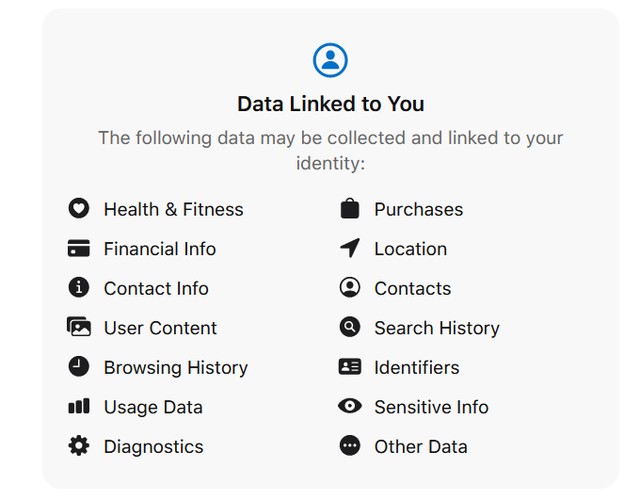
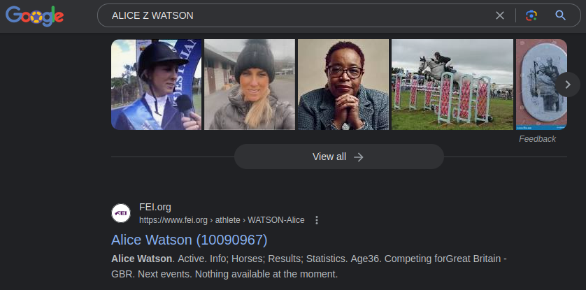
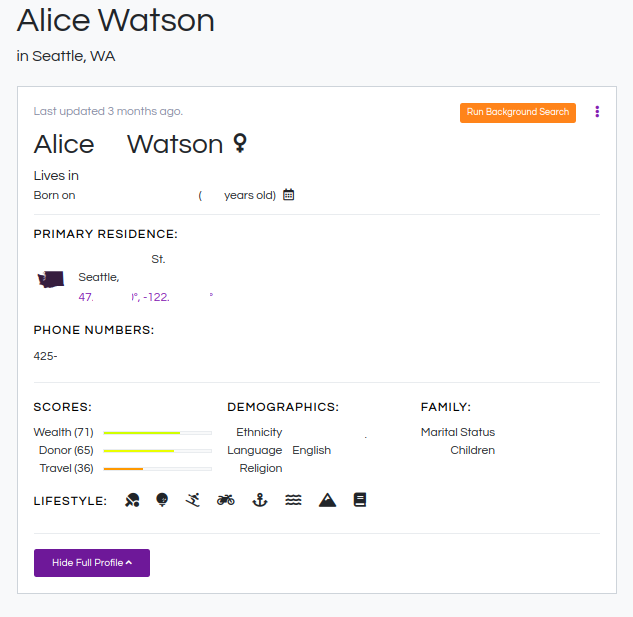
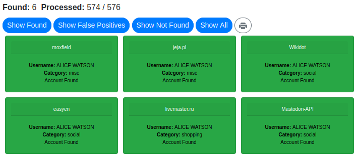

# If Data is the New Oil, Let's Make a Molotov

This project is currently a work in progress. Take it with a grain of salt and a spoonful of sugar. 

## About the Author

Hi, I'm Alice. You're already on my [GitHub](https://github.com/alicezwatson) page, and you can find my Mastodon profile [here](https://lgbtqia.space/@alice). 

I spend my days working in the gaming industry as a chief data officer, and I've worked in data & business analytics for many years. When I'm not at work, I queer it up online, rant about capitalism, and advocate for data privacy. 

As of writing, I think I'm currently most famous for a gif of a farting cat. Maybe this will change that, but knowing the internet, probably not. 

I've had quite a few people ask me about data privacy and data pollution in the past couple years, including a couple of my previous employees who kept urging me to write a book about it. I'm too lazy to write a whole dang book, but this is my attempt at answering some of those questions and offering up as much knowledge as I have on the topic. 

There are no ads, deals, or sponsors behind this project; it is 100% my own opinions and reseach, save for some input from Fediverse citizens who've commented on it. 

## Notes and To Dos
- [X] Address the (valid) critique of statistical techniques against data poisoning's effectiveness. 
  - See the Automated Fuckery section in part II. 
  - Should flesh it out some more.
- [ ] Flesh out Part II: Making Noise. Right now there's a lot of my train of thought. It should contain practical advice at different expertise levels for ruining the value of your data. 
- [ ] For Part III, add pages with walkthroughs and how-tos for various platforms, as well as specific tactics at different levels of paranoia.
- [ ] For Part IV, add resources for further reading.
- [ ] Add insider tips for getting analysts and systems to scrub your data during the munging/cleaning steps. Hint: `test`.

---

# Introduction

It feels like nowadays our data gets used against us as much—if not more—than for us.
With the current state of online tracking and surveillance, controlling *who* knows *what* about you is a daunting task.

Locking the digital doors and shuttering your Windows™ only goes so far.

Our goal is to render as useless as possible the kinds of data that are: scraped and sold by data brokers, collected by ISPs and companies for targeted advertising, used by Fortnite players and other malicious individuals for doxxing attacks, identity theft, and account takeovers, or by abusers, stalkers, governments, and law enforcement, for surveillance and harassment. 

To do that, we're going to: 1. Understand the data landscape, 2. figure out our threat model, 3. Explore ways of buggering up our data, and 4. Apply what we're learned. 

Let's introduce some of the threats we'll be facing: 

## Data Brokers
> Just watch [Data Brokers: Last Week Tonight with John Oliver (HBO)](https://www.youtube.com/watch?v=wqn3gR1WTcA). John Oliver does a great job of introducing the subject.

> The Department of Homeland Security and FBI have been purchasing personal data from brokers, including cell phone location data and home address information, circumventing democratic accountability as these agencies buy the data without warrants. 
> *Source: [Data Brokers Are a Threat to Democracy](https://www.wired.com/story/opinion-data-brokers-are-a-threat-to-democracy/)*

> "In a filing to the Federal Communication Commission, [ISPs] argued that providers should be able to sell customers’ internet history without the customers’ permission, because that information shouldn’t be considered sensitive." 
> **Source:** [Encryption Won’t Stop Your Internet Provider From Spying on You](https://www.theatlantic.com/technology/archive/2017/03/encryption-wont-stop-your-internet-provider-from-spying-on-you/521208/)

## Stalking and Abuse
> In the case of online victimization, certain information might facilitate the offender’s pursuit of the victim (e.g., e-mail addresses, instant messenger IDs) or make the individual a more desirable target (e.g., posting relationship status, photos, sexual orientation), thereby increasing an individual’s attractiveness as a target. 
> *Source: [Being Pursued Online: Applying Cyberlifestyle–Routine Activities Theory to Cyberstalking Victimization](https://citeseerx.ist.psu.edu/document?repid=rep1&type=pdf&doi=72d7a292f41dd1f97555893e995a8765a2d04db9)*

## Photos and Facial Recognition
> During the 2015 protests following Freddie Gray's death, the Baltimore County Police Department used facial recognition in combination with social media monitoring to track protesters. The police ran photos from social media posts through Maryland's facial recognition technology, enabling them to directly arrest individuals from the crowd. 
> *Source: [Clare Garvie's 2019 hearing at the House of Representatives](https://www.congress.gov/116/meeting/house/109521/witnesses/HHRG-116-GO00-Wstate-GarvieC-20190522.pdf)*

> In 2017, a suspect was captured on camera allegedly stealing beer from a CVS in New York City. When the low-quality surveillance image returned no matches on the NYPD's facial recognition system, the detectives used a high-quality images of actor Woody Harrelson, who bore some resemblance to the suspect. Using this method, they identified and arrested someone for petty larceny. 
> *Source: [Clare Garvie, Garbage In, Garbage Out](https://www.flawedfacedata.com/)*

## Targeted Manipulation
> "Our findings suggest that the application of psychological targeting makes it possible to influence the behavior of large groups of people by tailoring persuasive appeals to the psychological needs of the target audiences." 
> **Source:** [Psychological targeting as an effective approach to digital mass persuasion](https://www.ncbi.nlm.nih.gov/pmc/articles/PMC5715760/)

---

*Advertisement*
> Special thanks to this week's sponsor, ShiTsec VPN with *Shift*Blame™ technology. 
> ShiTsec is the only the free-to-play VPN service that's worth every penny! 
> ShiTsec's patented technology works by selling your data. It's that simple. 

---

# Part I: Threat Modeling

Threat modeling is a systematic approach to identify potential threats and vulnerabilities, that involves identifying assets, adversaries, attack surfaces, and making plans on how to mitigate those attacks or reduce the harm they can cause.

## 1: Identifying Assets

Before we can talk about ***how*** to protect ourselves, we need to determine the data or assets we want to protect. 
For this project, we're going to focus on two groups of data: **Personally Identifying Information** (PII), and **Behavioral Data** (BD).

### 1.1: Personally Identifying Information (PII)

PII is any data that could potentially identify a specific individual. This can range from full names, address, email addresses, to biometric data and IP addresses. Another common, but less obvious form of PII is device fingerprinting, where characteristics of your device, such as its operating system, screen size, font libraries, etc., are used to build a unique profile.

### 1.2: Behavioral Data (BD)

Behavioral data, also called "consumer insights", tracks user actions, habits, and decisions online. This can include everything from the links you click, what sites you visit and when, how far you scroll on a page, your social media activity, your digital purchases, your playlists, and anything else that paints a picture of your lifestyle, beliefs, and interests. 

Besides being used for targeted advertising, manipulation of consumer habits, and micro-targeting in political campaigns ([Cambridge Analytica](https://en.wikipedia.org/wiki/Facebook%E2%80%93Cambridge_Analytica_data_scandal) comes to mind), a less talked about use for this data comes in the form of routine identification—where you go and when you're vulnerable—which can be used by stalkers and abusers to choose or track potential victims.

## 1.3: Exercise: [Open Source Intelligence (OSINT)](https://www.sans.org/blog/what-is-open-source-intelligence/)

Start by plugging your name and/or profile names into some searches. 
Here are a few privacy-focused, big name, and specialty search engines to try: 

- StartPage (Google results): https://www.startpage.com/sp/search?q=ALICE+WATSON
- DuckDuckGo: https://duckduckgo.com/?q=ALICE+WATSON
- SearX: https://searx.org/search?q=ALICE+WATSON

- Google: https://www.google.com/?q=ALICE+WATSON
- Bing: https://www.bing.com/search?q=ALICE+WATSON
- Yandex: https://yandex.com/search/?text=ALICE+WATSON

- Whats My Name: https://whatsmyname.app/?q=ALICE+WATSON
- Thats Them: https://thatsthem.com/name/ALICE-WATSON
- Am I Unique (not exactly a search engine): https://amiunique.org/fingerprint

- (Advanced exercises) OSINT Framework: https://osintframework.com

Make a note of what you find. How many results are actually you? How many results are someone with the same name/handle? 

I recommend opening your favorite text editor (I use [Kate](https://kate-editor.org/) and [Obsidian](https://obsidian.md/)), and copying down the URLs that accurately identify you. You can add notes about what data each URL exposes, such as social, location, real name, etc. Keep this list handy, as you'll be revisiting it as you muck up your data.

Here's an example of what I found on Google: 

None of the results on the first 10 or so pages are me, but we find info on a bunch of other Alice Watsons. Creepily, there are a ***lot*** of obituaries for Alices. 

Here's an example of what I found on ThatsThem: 

None of the results were me (I already took care of this site), and I redacted most of the info on the profile, but it's an example of just how invasive these companies can be. 

Here's an example of what I found on WhatsMyName: 

Hey, that's me on the bottom right! 

## 2: Identifying Adversaries

We've already mentioned a number of adversaries above. For our purposes here, we'll use a more general definition: 
> **Anyone trying to piece together a broader or more detailed profile of us, who we *did not explicitly* intend to share such insights with.**

We can then roll those adversaries into 3 main groups: **bulk sellers**, **bulk buyers**, and interested **individuals**.

We want our solutions to make our data: 
1. too expensive for bulk sellers to collect & clean while maintaining a reasonable profit margin, 
2. too sketchy for bulk buyers to want to pay premium for it, 
3. and too sparse/anonymized to be a juicy target for interested individuals.

## 3: Understanding Existing Security Measures

What are we already doing and how well does it work?

### 3.1: Privacy-Respecting Browsers and Search Engines

#### 3.1.1: Private Browsing and Incognito Modes

> These modes do basically nothing to protect you from online tracking. They will, however, offer some protection from users *on the same device* viewing your browsing history or accessing your account on a site you were logged into. 
> *Source: [Away From Prying Eyes: Analyzing Usage and Understanding of Private Browsing](https://www.usenix.org/system/files/conference/soups2018/soups2018-habib-prying.pdf)*

> "We show that correctly implementing private browsing can be non-trivial, and in fact, all browsers fail in one way or another." 
> *Source: [An Analysis of Private Browsing Modes in Modern Browsers](https://www.usenix.org/legacy/events/sec10/tech/full_papers/Aggarwal.pdf)*

#### 3.1.2: Private Search Engines

> Private search engines function like regular search engines, but take measures to remove PII or disassociate it from the search queries. My personal recommendation (and the one I use) is [StartPage.com](https://www.startpage.com/), which provides solid anonymity and good results (by using Google's site index). 
> *Source: [Which private search engine is the most private?](https://www.startpage.com/privacy-please/privacy-advocate-articles/private-search-engine-comparison)*

### 3.2: VPNs

> VPNs have their place, such as when access to online resources is geo-restricted, but when it comes to security, they're more about shifting trust. Now that most of the web supports HTTPS, and most browsers warn of sites that don't, the perks of using a VPN have diminished considerably.

> "Many of the most popular VPN services are now also less trustworthy than in the past because they have been bought by larger companies with shady track records." 
> *Source: [It’s Time to Stop Paying for a VPN](https://www.nytimes.com/2021/10/06/technology/personaltech/are-vpns-worth-it.html)*

If you want to shift that trust to yourself, and you have some technical aptitude, then you can run your own VPN (such as [Algo VPN](https://github.com/trailofbits/algo)) for cheap-to-free.

### 3.3: Browser Plugins

> There are a billion browser plugins out there that claim to provide security. However, they come with the same issues as many VPNs—you're trusting a third party (often a single developer) to protect you. Secondly, part of browser fingerprinting involves which and how many plugins you have, so the more you install, the more unique your browser's fingerprint is. Now, I'm not disregarding browser plugins; in fact, I'm going to cover some in-depth later on. But for now, there are a couple that do what they say on the label and are worth noting here: 

- [AdNauseam](https://adnauseam.io/) — AdNauseam incorporates [uBlock Origin](https://ublockorigin.com/) and, alongside blocking ads, it clicks all of them.
- [Random User-Agent](https://github.com/tarampampam/random-user-agent) — This addon randomizes your browser's user-agent and changes it every few minutes.

## 4: Evaluating Potential Threats

Some of the assets and adversaries may stand out to you as particularly important. Which ones will depend on your personal threat model, and will vary from person to person. 

> If you're an activist or journalist, then maybe you're most worried about governments knowing your real-time location.

> If you're a female college student, then maybe you're worried about a stranger or another classmate knowing your dorm room and when you're away for your night class.

> Perhaps you're a member of a marginalized community, like the LGBTQIA+, and you don't want to be outed to family or co-workers.

Each of these require different considerations when managing your online presence and the data it leaves behind.

## 5: Determining the Impact

Assess the potential impact for each identified threat. Consider the severity of the fallout if the adversary had access to specific PII or BD.

## 6: Plan for Risk Mitigation

After identifying the risks and evaluating the impact, the next step is planning for risk mitigation. This involves selecting and prioritizing the measures or controls to reduce the risk of threats.

## 7: Regular Review and Update

Threat modeling is not a one-time process. You should routinely review and update your model to account for new assets, threats, and vulnerabilities.

---

# Part II: Making Noise

Now that we've set the stage and established our threat model, it's time to take some action. 

In this section, we'll explore different strategies that you can use to make noise and pollute your data online. By doing so, you can make it harder for adversaries to gather accurate information about you.

## 1: Old and Alternatives Accounts

One strategy is to create alternative accounts for various online platforms. This can help you segregate aspects of your life and provide an additional layer of privacy.

By using different usernames, email addresses, and other identifying information, you can make it harder for adversaries to link your online activities together.

You can lower your attack surface and add noise by logging into old accounts you don't use anymore and replacing accurate information in them with both plausible and obvious misinformation.

Wait a while, or request some search engines to reindex that page, then delete the account once the misinformation shows up in search results.

## 2: Opting Out

Data brokers and online platforms are required by law to provide an opt-out option that allows you to remove or limit the amount of personal information that they collect and share. Unfortunately, most also make the process so invasive or complicated that most people won't bother.

One big issue of note is that most of those sites will also have your relatives or roommates listed as well, and their profiles (with more accurate information on them) will point to yours. In order to deal with these, you might need to convince them to remove/pollute their data too or seed false connections so that the real ones are less likely to be immediately discovered.

## 3: Disinformation

> Intentionally polluting your data by sharing false or misleading information. By mixing in inaccurate details about your personal life, interests, or demographics, you can create noise and make it harder for adversaries to discern the truth.

> While data brokers will often ask you to jump through hoops to remove your profile from their sites, most allow you to add or "correct" information about yourself with a much lower barrier. If there are multiple results for your name, and some of them aren't you, consider changing parts of your profile to match their information.

## 4: Automated Fuckery

Automation can be a powerful tool to pollute your data online. By utilizing scripts, bots, or browser extensions, you can automate actions such as web browsing, social media activity, or search queries. This can help create noise and generate data that may not accurately reflect your actual behavior or interests.

I'm sure that, at this very moment, someone is typing a message to [me](https://lgbtqia.space/@alice) about how machine learning models and statistics can sniff out this fake data, and that it's worthless to go through the effort of polluting your data.

To them, I say, "you're right...sort of".

> "We demonstrated that a search engine, equipped with only a short-term history of the user's search queries, can break the privacy guarantees of TMN by only utilizing off-the-shelf machine learning classifiers." 
> *Source: [On the Privacy of Web Search Based on Query Obfuscation: A Case Study of TrackMeNot](https://www.freehaven.net/anonbib/papers/pets2010/p2-peddinti.pdf)*

> "Our simulation results show that the noise generated by our approach greatly reduces the privacy leakage and provides much better protection than uniform noise." 
> *Source: [Noise Injection for Search Privacy Protection](https://web.cs.ucdavis.edu/~hchen/paper/passat2009.pdf)*

It's a cat and mouse game. As the mouse, we don't have to beat the cat, we just have to not be worth its while.

**TODO:** Talk about tools like [ISP-Data-Pollution](https://github.com/essandess/isp-data-pollution) and browser plugins like AdNauseam and Random User-Agent.

## 5: Behavioral Changes

Lastly, consider making intentional behavioral changes to limit the amount of personal information you share online. For example, you can reduce your reliance on social media platforms, avoid oversharing personal details, and carefully consider the privacy settings of the apps and services you use. By being mindful of your digital footprint and being selective about the information you disclose, you can actively protect your data privacy.

---

# Part III: Walkthroughs

**TODO:** Add walkthroughs and how-tos for various platforms, as well as specific tactics at different levels of paranoia. 
**TODO:** Organize and expand on resources below. 

### Search Index Opt-Outs
- https://developers.google.com/search/blog/2007/04/requesting-removal-of-content-from-our#requesting-removal-of-content-you-dont-own

### Data Broker Opt-Outs (from [McAfee](https://www.mcafee.com/blogs/tips-tricks/how-to-remove-personal-information-from-data-broker-sites/):

> Acxiom: Go to the Acxiom opt-out form or call their support number at 877-774-2094. Pick which types of data you don’t want the company to gather. It can take a few weeks for your request to process.
  
> Epsilon: Email optout@epsilon.com and include your name and mailing address. You can also use the opt-out form to ask the company not to sell your personal information or delete your data entirely. If you don’t want to use email, you can call Epsilon’s phone number at 866-267-3861. Epsilon will have a third party verify your identity by asking questions about your personal information.  

> Oracle: Go to Oracle’s opt-out page. Type in your personal info and click submit. It can take up to a month for Oracle to process your request.  

> Equifax: On Equifax’s opt-out prescreen page, click “Click Here to Opt In or Opt Out” at the bottom of the page. Pick the option “Electronic Opt Out for Five Years.” You’ll have to provide some personal information. Click submit.  

> Experian: You’ll likely have to opt out of all of Experian’s services individually. Experian’s data sharing services include OmniActivation Strategic Services, Direct Mail, Telemarketing, and Email. You can also try sending an email to unsubscribeall@experian.com or unsubscribe@experian.com. If you send an email, include the exact phrase, “Unsubscribe me from Experian’s email database,” in your message.  

> CoreLogic: Email privacy@corelogic.com. Your subject line will need to be “California Privacy Rights Request.” Your email must state that you’d like to remove yourself from the companies’ databases and opt out of marketing programs. The email should have your name and address. If you don’t get a confirmation in about a week, follow up and ask for the status of your request. You can also try filling out the company’s opt-out form and mailing it to CoreLogic Teletrack Opt-Out Request, P.O. Box 509124, San Diego, CA, 92150. 

### Automated opt-out services:

**TODO:** I need to research these before I would recommend any of them. For now, they're just FYI.

> [Incogni (w/ 50% off)](https://incogni.com/deal/?transaction_id=102c539b639d2c71fe9b9c1a80c72c&offer_id=921&affiliate_id=2707&source=&aff_sub=&utm_source=Affiliates&utm_medium=2707&utm_campaign=affiliate&utm_content=921&recurring_goal_id=914)

> [DeleteMe](https://joindeleteme.com/) - I've used this before and it successfully removed me from a bunch of sites.

# Part IV: More Resources

**TODO:** Add more resources, duh.

- https://ssd.eff.org/
- https://ssd.eff.org/module/protecting-yourself-social-networks
- https://arxiv.org/pdf/1609.07922.pdf
- https://www.theatlantic.com/technology/archive/2017/04/hiding-the-signal-in-the-noise/522564/
- 
